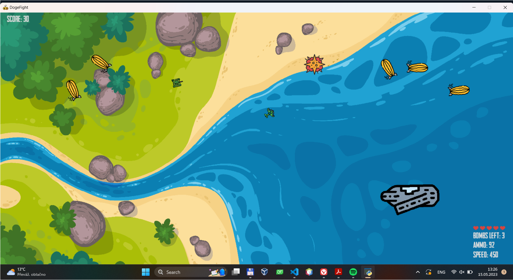

# Dogfight

A little pygame-based game I made. Control a plane, shoot things, pretty straightforward.

### Controls

So far, a plane can be controlled as follows:

`A / LEFT` to turn left

`D / RIGHT` to turn right

`W / UP` to increase speed

`S / DOWN` to decrease speed

`SPACE` to shoot a single bullet, currently, there is no cooldown, but the gun cannot fire in an automatic mode

`B` to deploy a bomb

`L_SHIFT / R_SHIFT` to show/hide a crosshair for bombs

### Mechanics

Several airships are spawned with random coordinates and rotation, once hit five times by a bullet, they explode. If the player crashes into an airship, the airship explodes as well, the player loses 2 HP (out of 5).

The amount of bullets is capped at 100, when all bullets are shot, the `SPACE` key plays the sound of an empty gun. Similarly, the bombs are capped at 5.

Other than crashing into airships, the player can get shot by an enemy anti-aircraft gun as well. Each shot is worth 1 HP. According to difficulty, which is currently hardcoded, there can be 0, 1, 2 or 3 anti-aircraft guns.

Once the player's HP drops to zero, the game loop stops. If any explosions are currently present, their time still runs, text 'GAME OVER' is displayed in the middle of the screen.

### AI

A simple rule based AI powers the anti-aircraft guns. Based on several possible collisions of rectangles, the AA guns rotate or change the direction of their rotation. The rectangles are:

- BLUE: always on the line between the player and the AA gun
- RED: where the AA gun aims
- GREEN: the very opposite of the RED one, when the player crosses this rectangle, the AA gun might alter its rotation direction
- YELLOW and PURPLE: auxiliary rectangles next to the RED one, these help determine whether the rotation direction should change after the gun no longer fires

If the RED and BLUE rectangles collide, the gun fires

### TODOs

TODO: add tank spawning rule