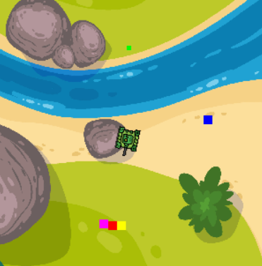

# Dogfight

A little pygame-based game I made. Control a plane, shoot things, do not get shot by other things. Pretty straightforward.

### Dependencies

- python 3.*, the newer, the better
- numpy
- pygame
- pygame_widgets

The libraries can all be installed individually with `pip install <name_of_the_library>`.

Alternatively, `pip install -r requirements.txt` installs them all.

To launch the game, do `python game.py`.

### Controls

The player's plane can be controlled as follows:

`A / LEFT` to turn left

`D / RIGHT` to turn right

`W / UP` to increase speed

`S / DOWN` to decrease speed

`SPACE` to shoot a single bullet, currently, there is no cooldown, but the gun cannot fire in an automatic mode

`B` to deploy a bomb

`L_SHIFT / R_SHIFT` to show/hide a crosshair for bombs

If the player is dead, the main menu can be instantly invoked by pressing `RETURN`, otherwise, it is displayed after 10 seconds.

In the main menu, `RETURN` starts the game with current difficulty and `Q` quits the game.

Four levels of difficulty can be selected in the main menu.

Several pieces of useful information are displayed in the bottom right corner of the screen.

### Mechanics

The player, since it is a plane, is always moving forward, its direction can however be altered by `A` and `D`. The speed of the player's movement can be increased by `W` or decreased by `S`. The faster the movement, the slower the rotation and vice versa. The movement speed changes by 50 and has values between 400 and 800.

The plaing field is bordered by what you can see on the screen, no more map loads if the player reaches the border. Instead, the player gets stuck in the direction of the border and depending on the angle between the player and the border, the player moves to the left or right. Rotation is still fully supported, so it is possible to return.

Several airships are spawned with random coordinates and rotation. Once hit five times by a player's bullet, they explode. If the player crashes into an airship, the airship explodes as well, the player loses 2 HP (out of 5).

The amount of bullets is capped at 100, 80, 60 or 50, depending on selected difficulty, when all bullets are shot, the `SPACE` key plays the sound of an empty gun. Similarly, the bombs are capped at 5.

Other than crashing into airships, the player can lose HP by getting shot by an enemy anti-aircraft gun as well. Each shot is worth 1 HP. According to difficulty, which is currently hardcoded, there can be 0, 1, 2 or 3 anti-aircraft guns.

Once the player's HP drops to zero, the game loop stops. If any explosions are currently present, their time still runs and they fade away like they normallu would. Text 'GAME OVER' is displayed in the middle of the screen.

### AI

A simple rule based AI powers the anti-aircraft guns. Based on several possible collisions of rectangles, the AA guns rotate or change the direction of their rotation. The rectangles are:

- BLUE: always on the line between the player and the AA gun
- RED: where the AA gun aims
- GREEN: the very opposite of the RED one, when the player crosses this rectangle, the AA gun might alter its rotation direction
- YELLOW and PURPLE: auxiliary rectangles next to the RED one, these help determine whether the rotation direction should change after the gun no longer fires

If the RED and BLUE rectangles collide, the gun fires

